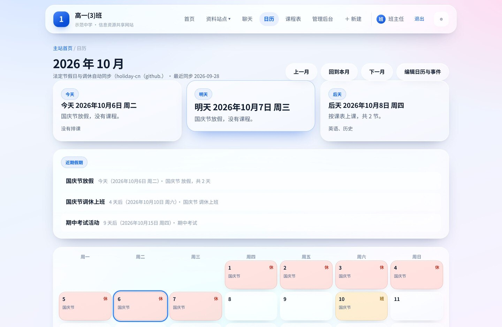
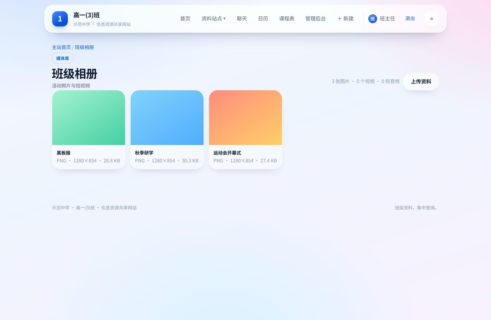
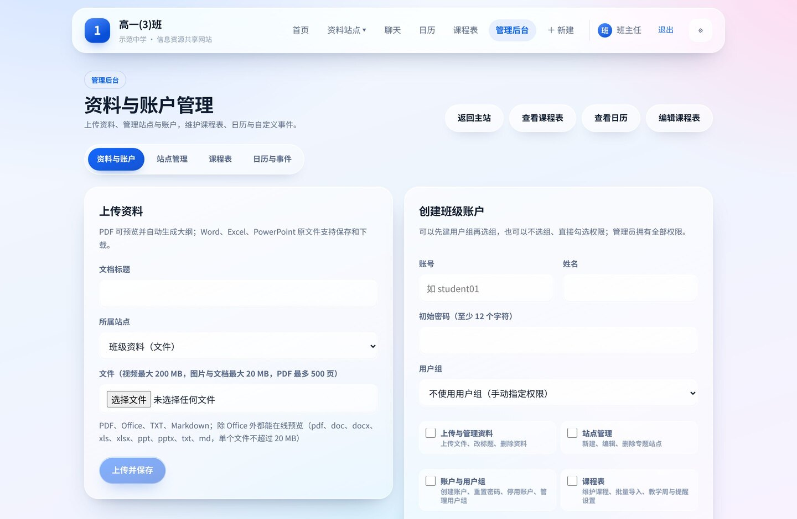
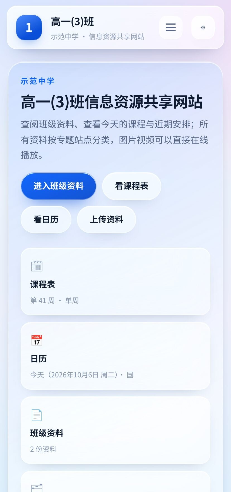
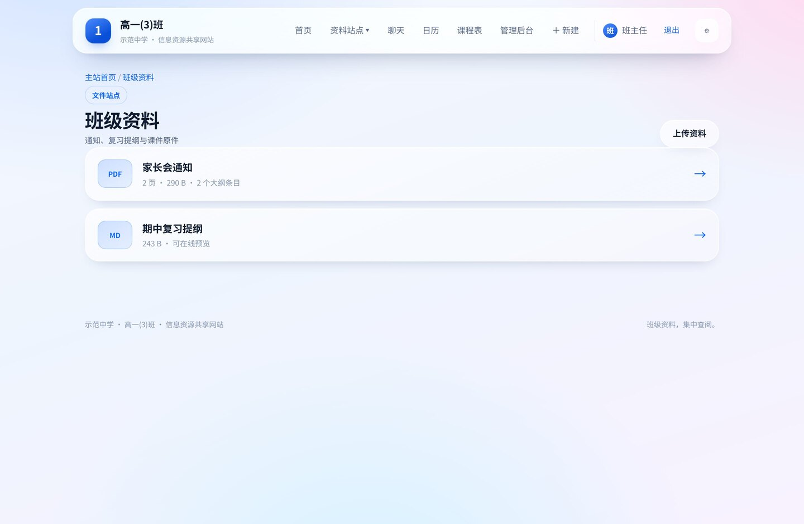

# class-hub · 班级信息资源共享网站

[**简体中文**](README.md) | [English](README.en.md)

[](https://github.com/wwccyy2912/class-hub/actions/workflows/ci.yml)
[](LICENSE)
[](https://nodejs.org/)
[](https://workers.cloudflare.com/)
[](CONTRIBUTING.md)

一个给中小学班级用的私有网站：**资料站点 + 课程表 + 日历调休 + 班级聊天 + 用户组权限**，全部跑在 Cloudflare 上（Workers + D1 + R2，免费额度内即可）。

> 没有内置管理员、没有示例数据、没有需要配置的密钥：部署完打开网址，用初始化向导填学校、班级、管理员密码就能用。

## 界面预览

| 首页 | 课程表 | 日历 |
| --- | --- | --- |
|  |  |  |

| 图册媒体库 | 班级聊天 | 管理后台 |
| --- | --- | --- |
|  |  |  |

| 深色模式 | 手机端 | 文件站点 |
| --- | --- | --- |
|  |  |  |

## 它是什么

- 老师用管理员账号在后台建**专题站点**（文件站点 / 文件夹站点 / 图册媒体库），上传 PDF、Office、文本、ZIP、图片、音视频；
- 同学用各自的班级账号登录，只读地浏览与下载：PDF 在线预览并自动生成大纲、TXT/Markdown 在线看、ZIP 在线浏览、图片视频音频用自带播放器播放；
- 首页/课程表/日历三处都显示「今天 / 明天 / 后天」提醒（标题始终带完整日期），日历自动同步法定节假日与调休，管理员可以指定调休日按哪一天的课表上课；
- 班级大群 + 一对一私聊，支持 @提醒、附件、撤回时限、历史消息自动清理，管理员可按用户组或按账号精细控制权限，并可对大群/私聊分别禁言；
- 全部界面跟随系统深浅色，采用液态玻璃（毛玻璃）视觉，手机端自适应。

## 功能一览

| 模块 | 说明 |
| --- | --- |
| 账号与权限 | 首次打开网站进入**初始化向导**（填学校、班级、管理员账号密码）；用户组 + 6 项细粒度权限；支持停用、删除账号、重置密码 |
| 专题站点 | 三种类型：文件站点（PDF/Office/TXT/MD）、文件夹站点（ZIP 在线浏览）、图册媒体库（图片转 WEBP、视频音频在线播放） |
| 资料阅读 | PDF.js 在线预览 + 书签/标题自动大纲；Markdown 渲染；Office 原文件下载 |
| 课程表 | 按星期/节次维护，支持连堂、单双周、教学周设置，Excel 粘贴批量导入 |
| 日历与调休 | 内置国务院节假日安排，一键同步官方数据，可覆盖某天（校运会等），调休指定按哪天上课 |
| 倒计时 | 首页/课程表/日历显示近期假期与自定义事件（开学、考试、运动会），窗口与条数可配置 |
| 班级聊天 | 大群 + 私聊、未读与 @ 角标、图片/文件附件、撤回时限、自动清理、禁言 |
| 大文件上传 | 视频/音频最大 200 MB，超过 8 MB 自动分片上传（R2 multipart），页面显示进度与速度 |
| 网络自适应 | 自动判定网络档位（省流/标准/高清）：缩略图、按需加载原图、悬停预取、视频不预载 |
| 轻量与缓存 | 静态资源内容指纹 + 长期缓存、只读接口 ETag、图标与 PDF 资源按需加载 |

## 技术栈

- **运行时**：Cloudflare Workers（ESM，单文件产物 `dist/server/index.js`）
- **数据库**：Cloudflare D1（SQLite）+ Drizzle schema/迁移（`drizzle/`）
- **对象存储**：Cloudflare R2（资料、图片、音视频、聊天附件）
- **前端**：原生 ES 模块单页应用（无框架），PDF.js 预览，Canvas 做图片转码与缩略图
- **测试**：`node --test` 单元测试 + 端到端套件（权限、聊天、分片上传）+ Chrome CDP 浏览器套件

## 目录结构

```
src/server/     Worker 入口、品牌设置、安全工具
src/shared/     前后端共用的纯函数（文件类型、课程表、ZIP、权限、PDF 大纲）
src/client/     浏览器端（单页应用、网络自适应、PDF 阅读器）
assets/         app.html / style.css / theme.js
db/             Drizzle 表结构
drizzle/        数据库迁移（0000–0010）
scripts/        构建（含图标生成、CSS 压缩、资源指纹）、打包、节假日同步、e2e 运行器
tests/          单元与端到端套件 · tests/browser/ 浏览器套件
docs/           使用说明、部署文档与界面截图
data/           节假日快照数据
```

## 本地运行

需要 **Node.js 22+**。

```bash
npm install
npm run build        # 生成 generated/* 与 dist/
npm run db:migrate   # 应用本地 D1 迁移
npm run dev          # http://127.0.0.1:4173
```

首次打开会进入初始化向导，填学校、班级、管理员账号与密码即可（密码至少 12 位）。本地 D1 与 R2 由 wrangler 在 `.wrangler/state/` 里模拟，不需要 Cloudflare 账号。

## 测试

```bash
npm test          # 单元测试
npm run test:e2e  # 端到端：自动启动本地服务并按顺序跑全部套件
```

浏览器套件（需要本机有 google-chrome，且本地服务已启动）：

```bash
export ADMIN_USER=owner ADMIN_PASSWORD='你的管理员密码'   # 浏览器套件用这个账号登录
npm run test:browser                  # 网络档位 / 聊天 / 账号 / 图标
node tests/browser/setup-groups.mjs   # 初始化向导 + 用户组与权限界面（需要全新数据库）
```

端到端套件与浏览器套件都通过初始化向导登录，账号默认 `owner`，密码取环境变量 `ADMIN_PASSWORD`。

## 部署到 Cloudflare

```bash
npx wrangler login
npx wrangler d1 create class-local                 # 把返回的 database_id 填进 wrangler.jsonc
npx wrangler r2 bucket create class-local-files    # 需要先在控制台启用 R2
npm run build && npm run deploy:migrate && npm run deploy
```

部署后打开 `https://<worker>.<你的子域>.workers.dev`，第一次会进入初始化向导。完整步骤见 [docs/部署到Cloudflare.md](docs/部署到Cloudflare.md)，日常使用说明见 [docs/使用说明.md](docs/使用说明.md)。

**不需要任何 Secret**：没有内置管理员凭据，管理员由初始化向导创建。

## 安全与隐私

- 口令使用 PBKDF2-SHA256（100000 次迭代 + 随机盐），会话 Cookie 为 HttpOnly + Secure + SameSite=Strict；
- 写操作校验 Origin，登录/改密有失败次数限制，未登录无法读取任何资料或聊天内容；
- 私聊消息与附件只有会话双方可读写（第三者一律 404）；
- 上传按站点类型做扩展名 + 文件头双重校验，图片/文档 20 MB、视频音频 200 MB 上限。

完整的安全模型、自托管注意事项与漏洞报告方式见 [SECURITY.md](SECURITY.md)。

## 参与贡献

欢迎提交 issue 和 PR：

- 上手步骤、代码风格与提交规范见 [CONTRIBUTING.md](CONTRIBUTING.md)；
- 行为准则见 [CODE_OF_CONDUCT.md](CODE_OF_CONDUCT.md)；
- 版本变化见 [CHANGELOG.md](CHANGELOG.md)。

## 许可证

本项目采用 **GNU General Public License v3.0 or later**（GPL-3.0-or-later），全文见 [LICENSE](LICENSE)。

你可以自由使用、修改和分发，但分发衍生作品时必须同样以 GPL-3 开源，并保留版权与许可声明。

```
Copyright (C) 2026 class-hub contributors

This program is free software: you can redistribute it and/or modify it under
the terms of the GNU General Public License as published by the Free Software
Foundation, either version 3 of the License, or (at your option) any later version.
```
